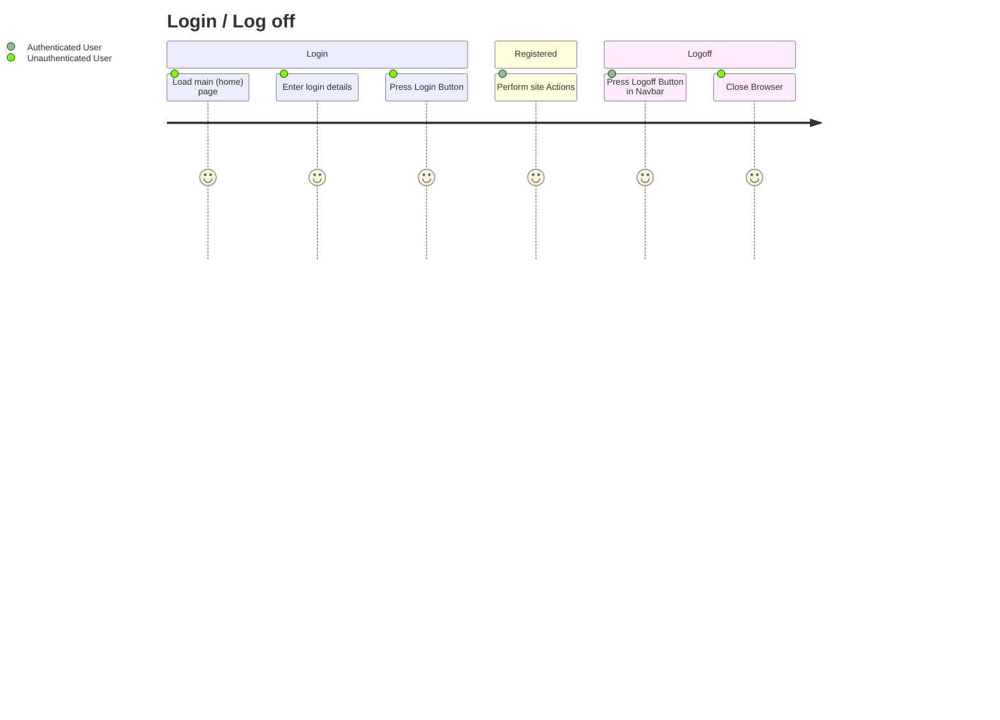
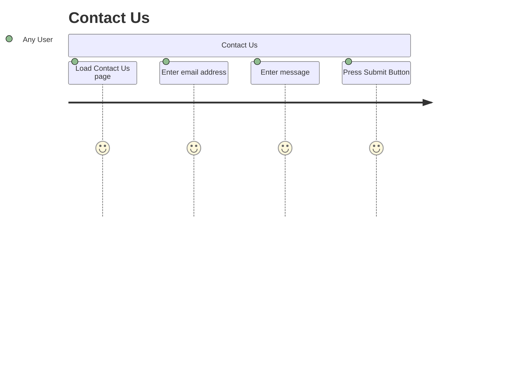
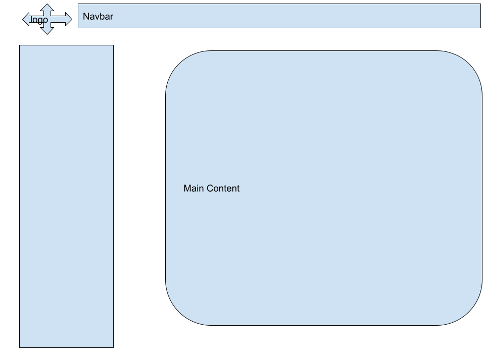

# Project Overview

This PHP website will be an ecommerce site to sell handmade star wars memorabilia.

## User Management
Users will be able to login, log out, reset their passwords, and edit their details.

Users will need to store:
- Name
- DOB
- Hashed password
- Access Level (user vs Administrator)
- Status (active or disabled)

## Product Management

Administrators will be able to add, remove, edit products. 

Products will have:
- A name
- A price
- A description
- Quantity

# Behaviour User Journey

# Planning Diagram - Wireframes

